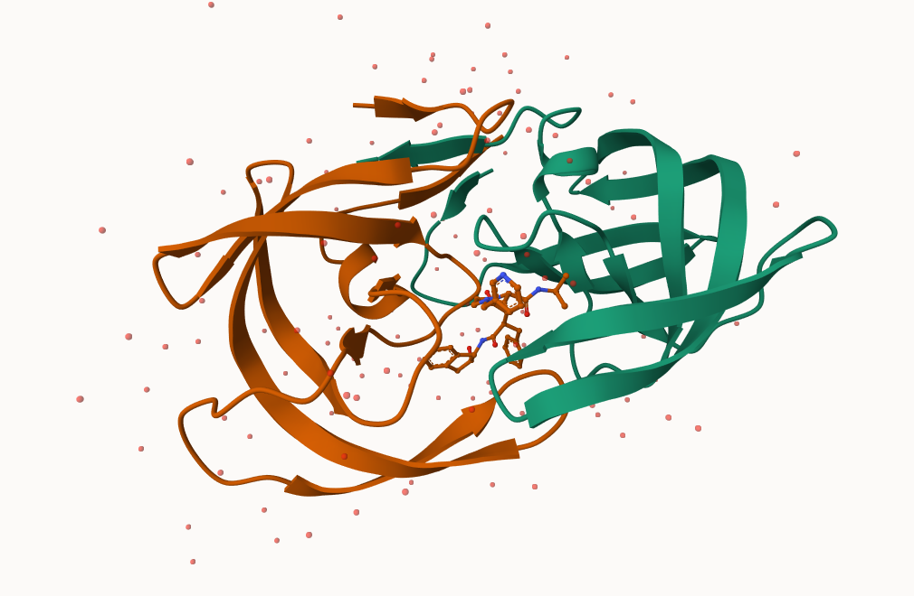
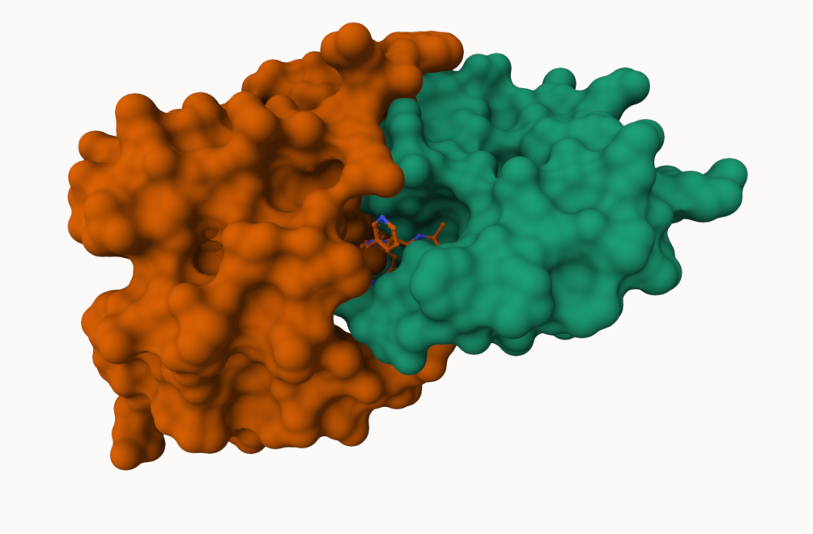

## Background

The main repository of high-resolution strutural data on biomolecules is called the **Protein Data Bank (PDB)**

## PDB statistics

What is in the PDB in terms of molecule tpype and structure determination method?

Read a CSV file of current PDB sats obtained from https://www.rcsb.org/stats/summary
```{r}
pdb <- read.csv("Data Export Summary.csv")
head(pdb)
```

> **Q1. What percentage of structures in the PDB are solved by X-Ray and Electron Microscopy.**

```{r}
pdb$X.ray
```
This print out above `pdb$X.ray` is "character" not "numeric". Therefore I can't do math with it. We need to fix this...

Two functions that can help there are `sub()` and `as.numeric()`

```{r}
# We want to get rid 9or sub out) commas:
x <- pdb$X.ray
tmp <- sub(",", "", x=pdb$X.ray)
sum( as.numeric(tmp) )
```
We could make a function to do this:
```{r}
rm.comma <- function(x) {
  tmp <- sub(",", "", x)
  sum(as.numeric(tmp) )
}
```

```{r}
n.tot <- rm.comma(pdb$Total)
n.xray <- rm.comma(pdb$X.ray)
n.em <- rm.comma(pdb$EM)

n.xray/n.tot * 100
n.em/n.tot * 100
```

We could also use a different import function `read_csv()` for this CSV that speaks American (i.e. deals with commas in numbers in a comma separated value file)

```{r}
library(readr)

read_csv("Data Export Summary.csv")
```
```{r}
n.tot <- pdb$Total
n.xray <- sum(pdb$`X-ray`)

```

> How many total protein structures are there in the dataset?

```{r}
pdb$Total[1]
```
The total number of protein sequences in UniProt is 202,556,314.

```{r}
217375/202556314 * 100
```
> **Key-point**: We have very small structural coverage of known proteins (~0.1%). Most structures we know about (~80%) come from one method X-ray crystalography). 

> **Q2: What proportion of structures in the PDB are protein?**

Approximately ~85–90% of structures in the PDB are proteins.

> **Q3: Type HIV in the PDB website search box on the home page and determine how many HIV-1 protease structures are in the current PDB?**

There are approximately 1227 HIV-1 protease structures in the PDB.

## Visualizing PDB data with Mol-star

Main stand alone web version with all features is at https://molstar.org/viewer/






```{r}
#Pak can install from multiple sources
#install.packages("pak")

pak::pkg_install( c("bioboot/bio3dview", #Github
                    "NGLVieweR",        #CRAN
                    "bioc::msa"))      #Bioconductor
```

> **Q4: Water molecules normally have 3 atoms. Why do we see just one atom per water molecule in this structure?**

Water molecules normally have three atoms (H₂O), but in X-ray crystal structures only the oxygen atom is visible. This is because hydrogen atoms are too small and have too few electrons to be detected reliably, so only the oxygen atom is resolved in the structure.

> **Q5: There is a critical “conserved” water molecule in the binding site. Can you identify this water molecule? What residue number does this water molecule have? **

A conserved water molecule (HOH) is located in the binding site, forming hydrogen bonds between the ligand and the catalytic residues. The residue number corresponds to a labeled HOH molecule in the active site (e.g., HOH 301).


> **Q6: Generate and save a figure clearly showing the two distinct chains of HIV-protease along with the ligand. You might also consider showing the catalytic residues ASP 25 in each chain and the critical water (we recommend “Ball & Stick” for these side-chains). Add this figure to your Quarto document.**

HIV protease has flexible “flap” regions that open and close over the active site. This flexibility allows large ligands such as indinavir to enter the binding pocket. Once inside, the flaps close to stabilize binding through interactions with the ligand and catalytic residues.

> **Q7: [Optional] As you have hopefully observed HIV protease is a homodimer (i.e. it is composed of two identical chains). With the aid of the graphic display can you identify secondary structure elements that are likely to only form in the dimer rather than the monomer?**

HIV protease is a homodimer, and the dimer interface forms β-sheet interactions between the two chains. These inter-chain β-sheets stabilize the structure and are not present in a single monomer, meaning they only form upon dimerization.


## Getting Started with the Bio3D package

Bio3D is an R package from CRAN for structural bioinformatics
```{r}
library(bio3d)

pdb <- read.pdb("1hsg")
pdb
```
> **Q7: How many amino acid residues are there in this pdb object? **

198 amino acid residues

> **Q8: Name one of the two non-protein residues? **

Q8: Name one non-protein residue

Non-protein/nucleic resid values: [ HOH (127), MK1 (1) ] ; HOH (water)
OR MK1 (ligand)

> **Q9: How many protein chains are in this structure?** 

Q9: How many protein chains?

2 (values: A B)

```{r}
attributes(pdb)
```
```{r}
head(pdb$atom, 6)
```
There are lots of functions that can work with these `pdb` objects
```{r}
head( pdbseq(pdb) )
```

We can have a quick interactive view of any of these `pdb` objects:

```{r}
#library(bio3dview)

#view.pdb(pdb)
```
Let's try a custom view
```{r}
#view.pdb(pdb, colorScheme = "sse", backgroundColor = "black")
```
> Q. Create a custom view highlighting the active site ASP (`resno=25`), the two chains (in your choice of colors) and the ligand all on a custom color background? 

```{r}
#library(NGLVieweR)
#active.site <- atom.select(pdb, resno=25)

#view.pdb(pdb, 
         #cols = c("purple", "orange"),
        # highlight = active.site,
        # highlight.style = "spacefill", 
        # backgroundColor = "lightpink") |> 
 # setRock()
```

## Predict the flexibility of a given structure

Let's do a Normal Mode Analysis (NMA) to predict the flexibility of a given `pdb` object:

```{r}
adk <- read.pdb("6s36")
```

A quick structure summary
```{r}
adk
```
```{r}
m <- nma(adk)
plot(m)
```
View the results with an 
```{r}
#view.nma(m)
```

Write out the results for viewing in Mol-star:

```{r}
mktrj(m, file="nma.pdb")
```

## Comparative analysis of the ADK family

Our first step is find a sequence for this family. We will use the database ID "1ake_A" here:

```{r}
id <- "1ake_A"

aa <- get.seq(id)
aa
```

Search for related sequences in the database

```{r}
blast <- blast.pdb(aa)
```

```{r}
head(blast$hit.tbl)
```

```{r}
hits <- plot(blast)
```

```{r}
hits$pdb.id
```

```{r}
files <- get.pdb(hits$pdb.id, path="pdbs", split=TRUE, gzip=TRUE)
```

Align and supperpose all these ADK structures

```{r}
pdbs <- pdbaln(files, fit = TRUE, exefile="msa")
```

```{r}
pdbs
```

Quick interactive structural view
```{r}
#view.pdbs(pdbs)
```

PCA of all this structural data (x, y and z atom coordinates): 

```{r}
pc <- pca(pdbs)
plot(pc)
```

```{r}
plot(pc, 1:2)
```
Interactive view of the PC1 captured structureal differences:

```{r}
#view.pca(pc)
```


```{r}
mktrj(pc, file="pca.pdb")
```

> **Q10. Which of the packages above is found only on BioConductor and not CRAN?**

msa

> **Q11. Which of the above packages is not found on BioConductor or CRAN?**

bio3dview

> **Q12. True or False? Functions from the pak package can be used to install packages from GitHub and BitBucket?**

YES — pak can install from:

CRAN
GitHub
Bitbucket